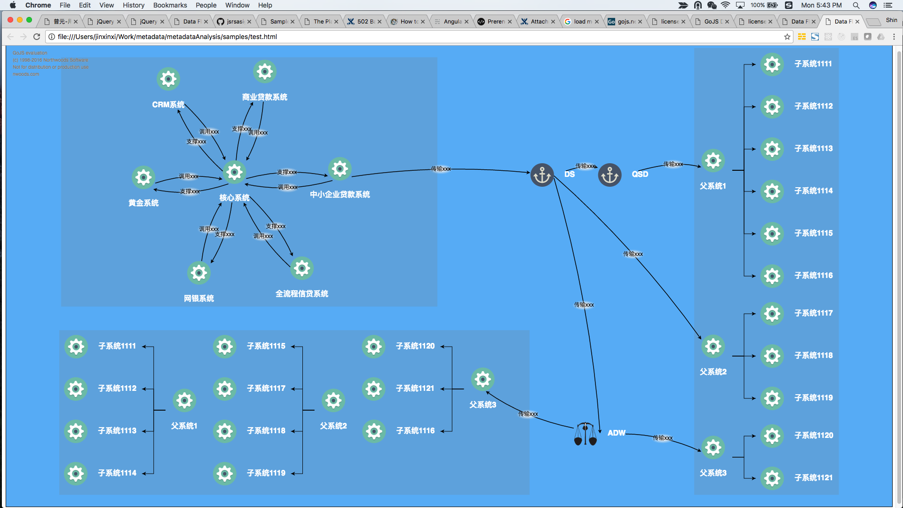
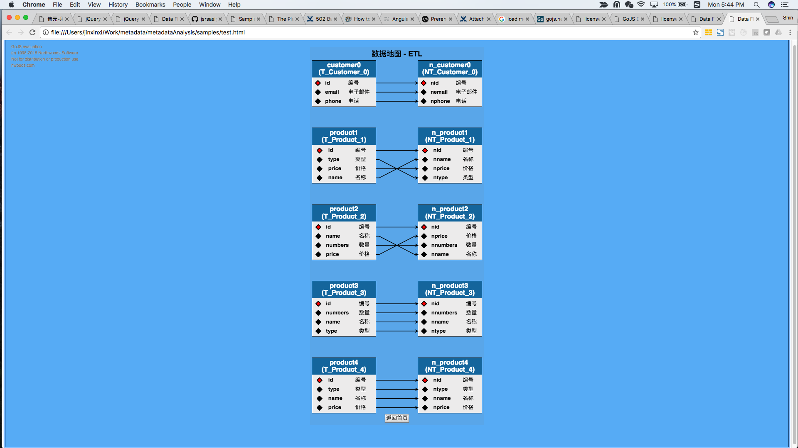
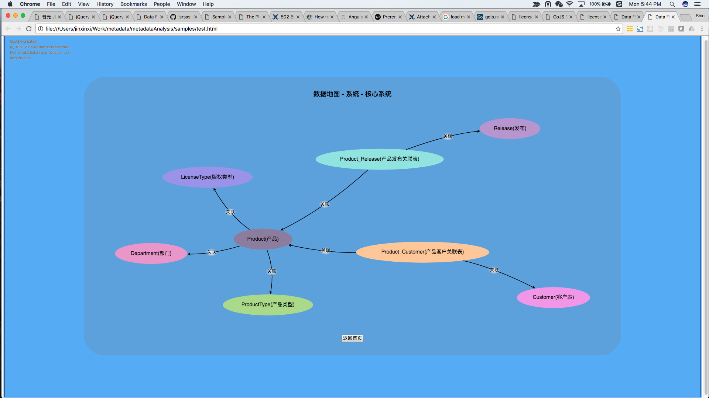
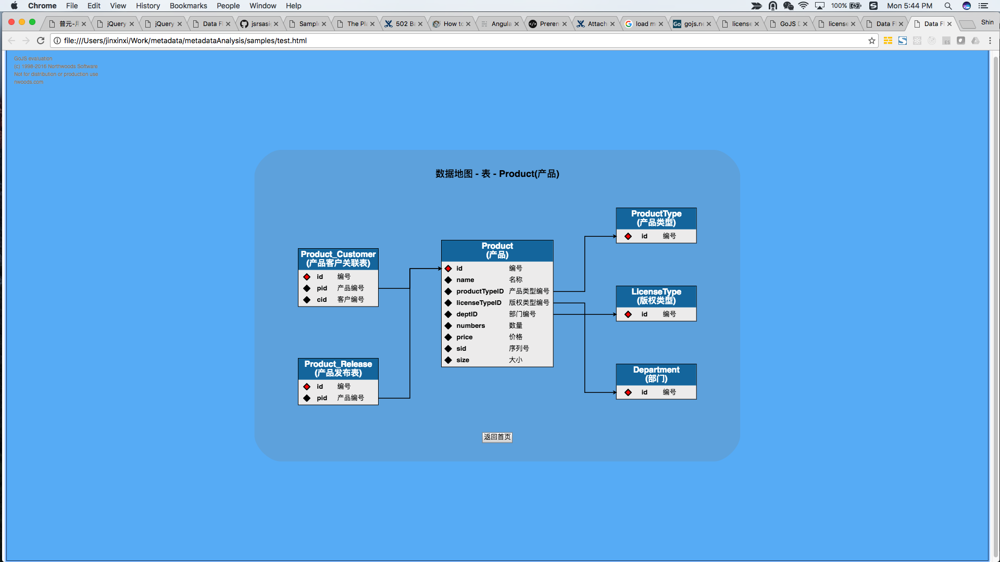
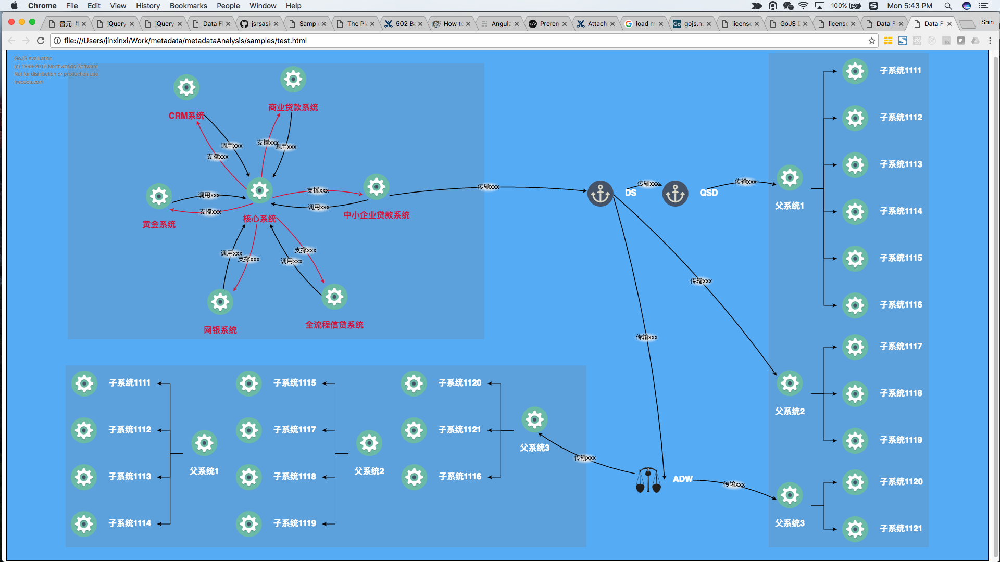
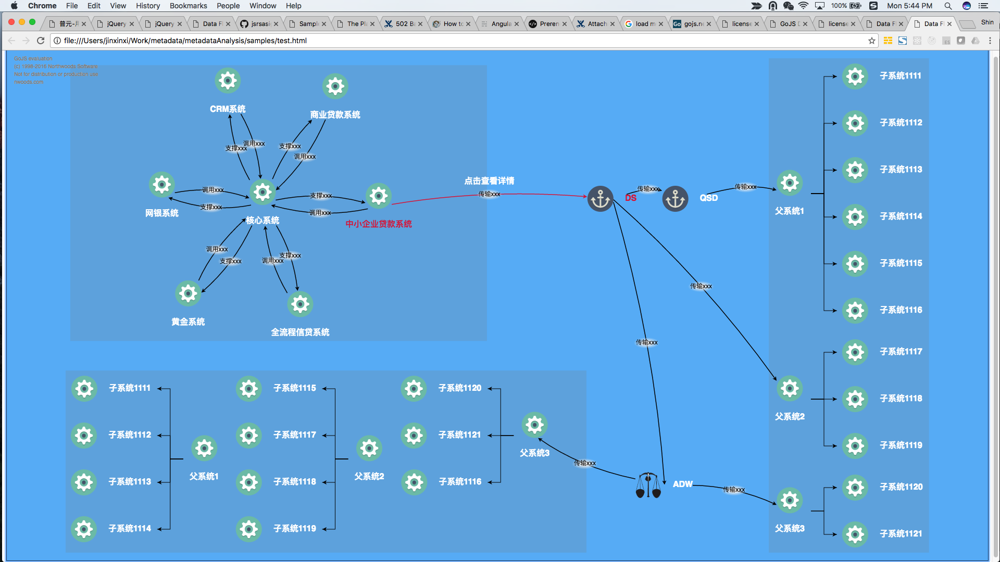

# metadatavisualizationdemo
A demo for Metadata Analysis Visulization, powered by GoJS


# How to use

## Download Zip
Just download the zip file and unzip it.
Open index.html at any morden browser.

## NPM
If you have npm installed, at root directory you can just type 
```
npm install
npm start
```
And enjoy at localhost:8000

# Features

- [Product Overall Architecture & Data Flow](#Product Overall Architecture & Data Flow)
- [ETL Data Mapping](#ETL Data Mapping)
- [System Table Diagram](#System Table Diagram)
- [Table Detail Diagram](#Table Detail Diagram)
- [Information HighLighting](#Information HighLighting)


# Overall System Architecture & Data Flow

A top diagram represents the relations and data flows of product systems.



# ETL Data Mapping

Data mapping of two related systems.


# System Table Diagram

System all related tables.


# Table Detail Diagram

Table database structure and its relations with other tables.


# Information HighLighting

Link and Node Highlighting.


